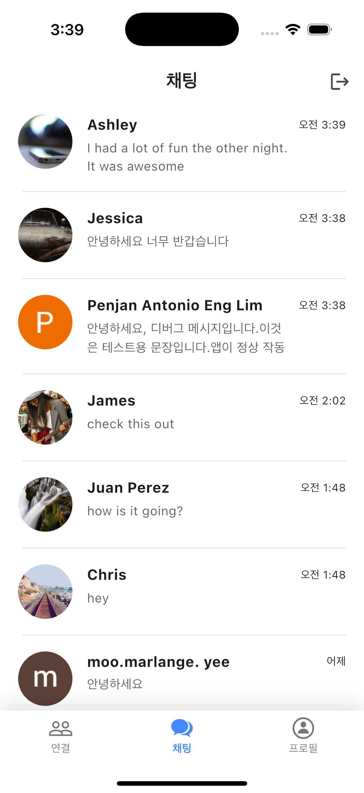

# LangMate - 언어 교환 학습 파트너 매칭 앱

<p align="center">  </p>

## 📌 프로젝트 소개

LangMate는 Flutter로 개발된 언어 교환 파트너 매칭 앱입니다. 사용자들은 자신의 모국어와 배우고자 하는 언어를 설정하고, 상호 보완적인 언어 조합을 가진 주변 사용자들을 찾아 대화할 수 있습니다. 위치 기반 검색을 통해 가까운 지역의 언어 파트너를 찾고, 실시간 채팅으로 언어 학습을 위한 소통이 가능합니다.

## 📱 스크린샷

<div style="background-color: #F1F2F1; padding: 20px; border-radius: 12px;">
  <div style="display: flex; flex-wrap: wrap; gap: 20px; justify-content: flex-start;">
    
    
    
    
    
    
    
    
    
    
    
    
  </div>
</div>

## 🎯 주요 기능

- **간편한 Google 계정 로그인**: Firebase Authentication을 활용해 별도 회원가입 없이 Google 계정으로 빠르게 시작
- **맞춤형 언어 파트너 매칭**: 내 모국어와 학습 언어를 기준으로 최적의 언어 교환 파트너 추천
- **지역 기반 탐색**: 실시간 위치를 활용해 가까운 거리의 언어 파트너 검색 및 정확한 거리 표시
- **실시간 채팅**: 사용자 간 1:1 채팅 기능 제공, 텍스트 및 이미지 전송 지원
- **상세 프로필 보기**: 언어 능력, 학습 목표, 자기소개 등 다양한 정보 설정 기능
- **프로필 편집**: 이름, 프로필 사진, 자기소개, 모국어 및 학습 언어, 위치/지역, 생년월일 (나이) 업데이트

## ✨ 추가 기능

### 1. 채팅 기능

- **채팅방 그룹화**: 오늘, 어제 등 날짜별로 대화 메시지 그룹화
- **채팅방 삭제**: 채팅방 목록에서 좌측으로 스와이프하여 대화 내역 삭제
- **스크롤 자동화**: 대화방 입장 시 자동으로 최신 메시지로 스크롤
- **이미지 전송**: 채팅 내 이미지 전송 및 표시 기능
- **채팅방 없을 때 애니메이션 표시**: Lottie 애니메이션을 활용한 빈 채팅 리스트 화면 제공

### 2. 사용자 경험

- **자동 리다이렉션**: 로그인 상태 및 프로필 완성도에 따라 적절한 페이지로 자동 이동
- **프로필 이미지 관리**: Firebase Storage를 활용한 프로필 이미지 업로드 및 저장
- **날짜 선택기**: 한국어 지원 날짜 선택 기능으로 생년월일 설정
- **위치 정보 갱신**: 현재 위치 자동 감지 및 거리 계산 기능

### 3. UI/UX 향상

- **이미지 캐싱**: cached_network_image를 이용한 네트워크 이미지 효율적 로딩 및 캐싱
- **커스텀 에러 메시지**: 인터넷 연결 끊김 등 다양한 상황에 맞는 커스텀 오류 화면
- **다양한 검증**: 사용자 입력에 대한 검증 및 피드백 제공

### 4. 보안

- **Firebase 인증**: 안전한 Google 계정 연동 로그인
- **데이터 지속성**: Firestore를 활용한 사용자 데이터 및 채팅 메시지 저장
- **로그인 상태 유지**: 앱 재실행 시 로그인 상태 유지 기능

## 📋 프로젝트 구조

```
lib/
├── app/                           # 앱 전체에서 설정 및 공통 상수, 테마 등
│   ├── app_providers.dart         
│   ├── theme.dart
│   └── constants/
│       ├── app_constants.dart
│       ├── app_colors.dart
│       └── app_styles.dart
├── core/                            # 앱 전체에서 사용되는 앱 핵심 기능 및 유틸리티 클래스
│   ├── exceptions/                  # 앱 전체에서 사용되는 예회 클래스 
│   │   └── data_exceptions.dart
│   ├── services/                    # 비즈니스 로직 및 외부 서비스 연동
│   └── utils/                       # 핼퍼 함수 및 유틸리티 클래스 
├── data/                             # 데이터 관련 클래스 및 데이터 액세스 계층
│   ├── dto/                          # 데이터 전송 객체
│   ├── model/                        # 데이터 모델
│   ├── network/                      # 네트워크 통싱 관련 클래스
│   │   └── dio_clients.dart
│   └── repository/                   # 데이터 접근 및 비즈니스 로직 구현
├── ui/                              # 사용자 interface 
│   ├── pages/                       # 각 화면
│   │   └── home/
│   │       ├── home_page.dart
│   │       ├── home_view_model.dart
│   │       └── widgets/             # 그 화면 관련 위젯
│   └── widgets/                     # 앱 전체에서 재사용 가능한 위젯
├── main.dart
```

## 📦 의존성 패키지

프로젝트에서 사용된 주요 패키지:

- **flutter_riverpod**: 상태 관리
- **geolocator**: 위치 정보 수집 및 거리 계산
- **image_picker**: 사용자 이미지 선택 및 업로드
- **cached_network_image**: 네트워크 이미지 캐싱
- **lottie**: 애니메이션 표시
- **intl**: 국제화 및 날짜 포맷팅
- **dio**: HTTP 클라이언트 및 네트워크 요청 처리
- **flutter_dotenv**: 환경 변수 관리
- **flutter_native_splash**: 네이티브 스플래시 화면 구현
- **flutter_localizations**: 다국어 지원
- **firebase_core**: Firebase 서비스 초기화
- **firebase_auth**: 사용자 인증 관리
- **google_sign_in**: Google 계정 로그인 지원
- **cloud_firestore**: 데이터베이스 저장 및 조회
- **firebase_storage**: 이미지 저장소


## 📄 라이센스

이 프로젝트는 MIT 라이센스 하에 제공됩니다. 자세한 내용은 [LICENSE](LICENSE) 파일을 참조하세요.